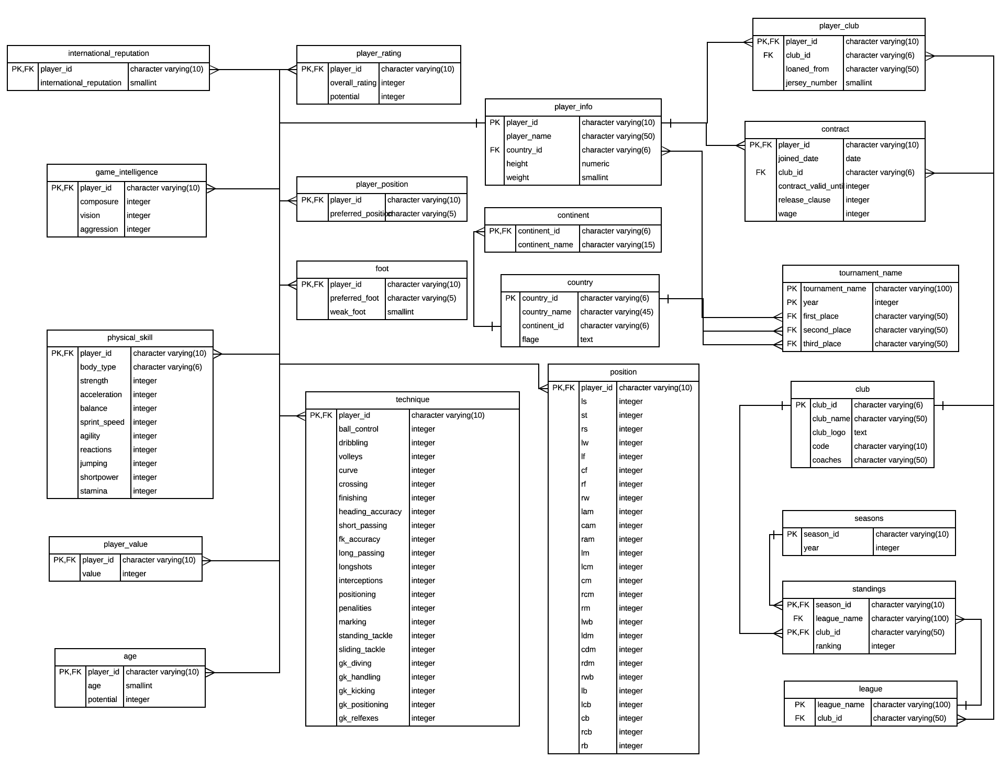
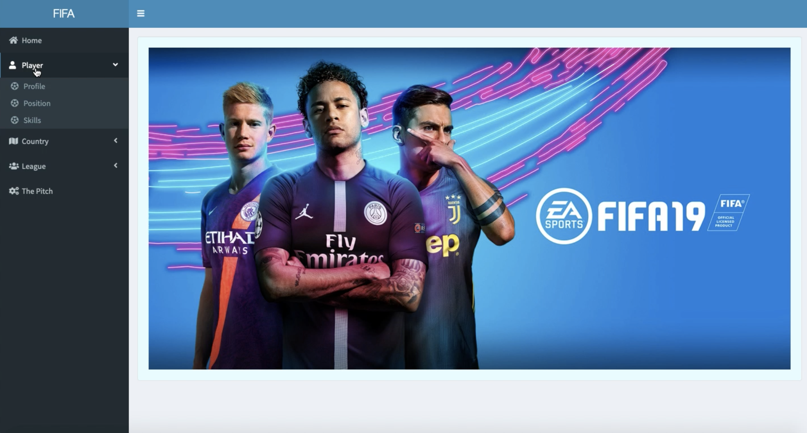
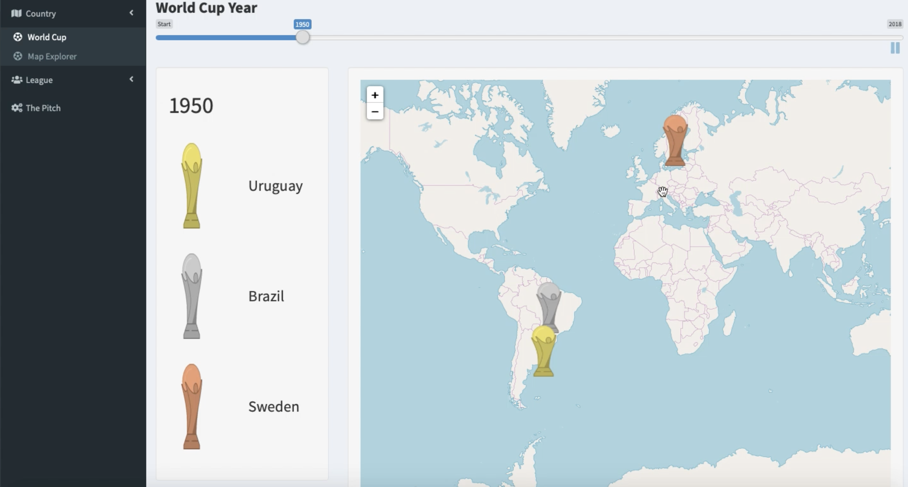
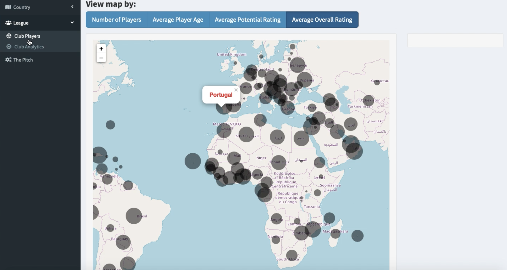
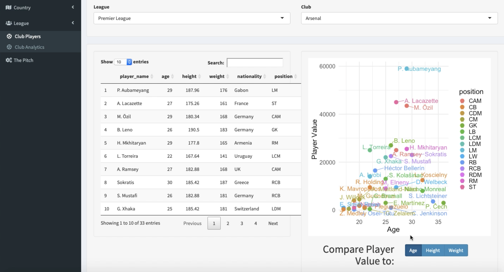

# SQL-and-Relational-Databases-Project
SQL and Relational Databases course group project, Columbia University(2019 Spring)

Teammates: @ZhijunLiu96, Kaiying Mo, Yuanyuan Li, Amy Fa

Project timeline:

**Checkpoint1:**
- Develop a draft database schema for the project's scenario

**Checkpoint2:**
- Finalize the design of our database schema(normalization plan)
- Draw both the ER diagram in Lucidchart; submit the SQL code for database design. 

**Checkpoint3:**
- Submit plan for transforming and entering the data to database system with R.
- Include the R scripts you have developed. 
- Explain plans and reasoning

**Checkpoint4:**
- Visualize the insights with R Shiny
- Submit plan for how the customers will interact with the database we designed.

**Chekcpoint5:**
- Complete the presentation slides and report

## Design 
### Database schema in 3NF [code](Schema/fifa%203NF%20populate.Rmd)

## ETL Process
### Extract: Data Source
- FIFA 2018 Complete Player Dataset: [Kaggle](https://www.kaggle.com/thec03u5/fifa-18-demo-player-dataset)
- Club coach: [ClubWorldRanking](https://www.clubworldranking.com/ranking-coaches?wd=16&yr=2019&index=0) ([scraying code](coaches.py))
- League and Club: [Skysports](https://www.skysports.com/football/teams)([scrapying code](leagues.py))
- Standing: [Skysports](https://www.skysports.com/football/tables)([scrapying code](standings.py))

### Transform 
- [Data cleaning](datacleansing.rmd)
- Recalculate
- Impute/Delete missing data

### Load
- Load the data into database using Rmd

## Dashboard: Rshiny ([global.R](RShiny_environment/global.R) | [server.R](RShiny_environment/server.R)  | [ui.R](RShiny_environment/ui.R) )

- Homepage

- Player Analysis
> Player Profile | Skills Comparison | Ranking by Position
>>Player Profile
>>

>> SKills Comparison 
>>

>> Ranking by Position
>

- Country
> World Cup | Map Explorer
>> World_cup_winner_by_year
>>
>>Talent_distribution_by_country
>>

- League
> Players' info in different leagues
>

- SQL Pitch 
> For users to DIY their own SQL queries
>

